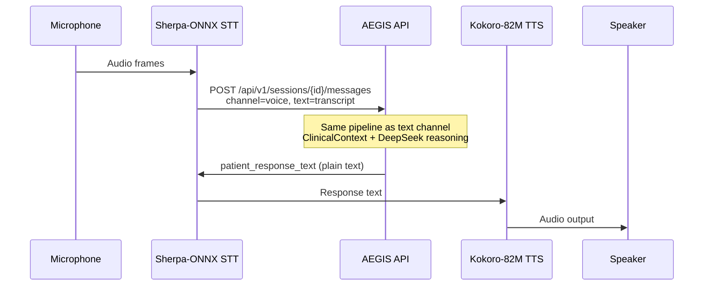

# Voice Pipeline

## Architecture principle

All speech processing occurs on the **client device**. The backend receives
transcribed text and returns plain-text responses for client-side synthesis.
No audio bytes are uploaded or processed server-side.

## Client stack

| Stage | Component | Location |
|-------|-----------|----------|
| Speech-to-text | Sherpa-ONNX | Client device |
| Clinical reasoning | AEGIS REST API | Server |
| Text-to-speech | Kokoro-82M | Client device |

## Sequence



## API contract

Create a session with `channel: "voice"` (optional — channel may also be set per message):

```json
POST /api/v1/sessions
{
  "patient_id": "mock-patient-001",
  "channel": "voice"
}
```

Send a voice turn (transcript from Sherpa-ONNX):

```json
POST /api/v1/sessions/{session_id}/messages
{
  "session_id": "{session_id}",
  "user_id": "mock-patient-001",
  "text": "transcribed utterance",
  "channel": "voice"
}
```

Response (identical shape to text channel):

```json
{
  "patient_response_text": "...",
  "ui_hints": {},
  "session_id": "..."
}
```

The client passes `patient_response_text` to Kokoro-82M for playback.

## Backend behaviour

- `app/agents/voice.py` normalises the channel flag and strips whitespace.
- `SessionMessage.channel` is stored as `"voice"` for analytics.
- Rolling summary, safety layer, and clinician layer processing are unchanged from text.

## Error handling

Network or API errors on the client should fall back to displaying the error message
or prompting retry. Emergency disclaimers in `patient_response_text` must still be
read aloud when present.

## Related documentation

- [README](../README.md) — environment and quick start
- [TRAINING_AND_QUALITY.md](./TRAINING_AND_QUALITY.md) — consultation quality model
