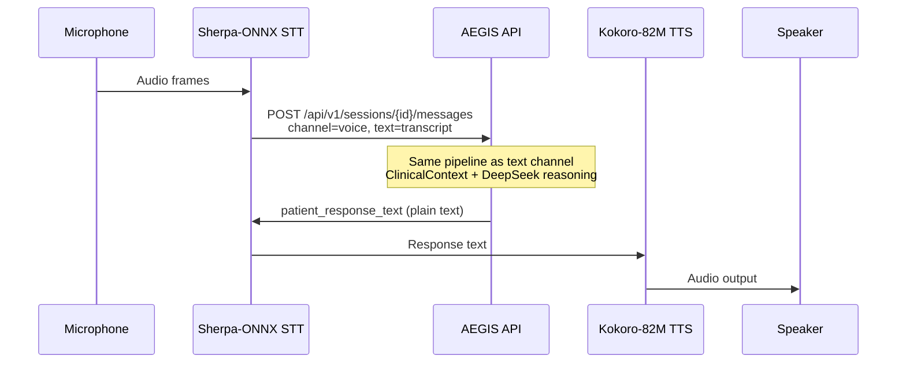
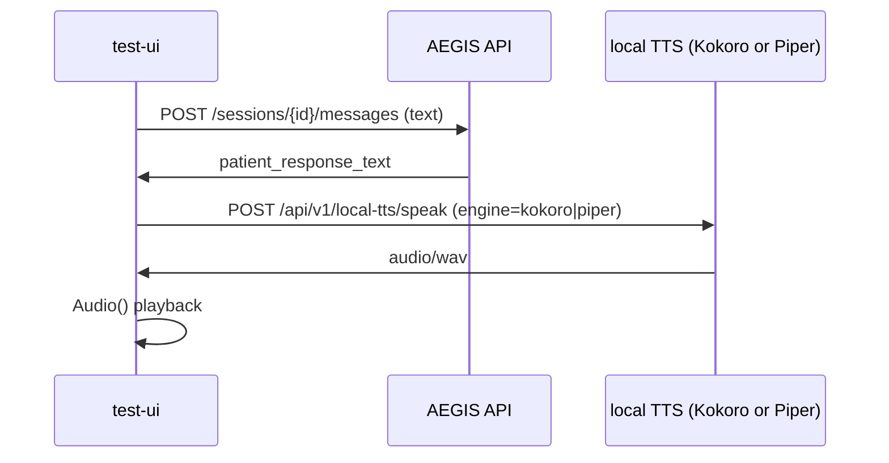

# Voice Pipeline

## Architecture principle

Clinical consultation stays **text-only** on the server. Speech processing for
end users runs on the **client device** (or, for local dev only, on the same
machine via Piper — see below).

The backend receives transcribed text and returns plain-text responses. No audio
bytes are uploaded as part of the AEGIS consultation API.

## Client stack (production)

| Stage | Component | Location |
|-------|-----------|----------|
| Speech-to-text | Sherpa-ONNX | Client device |
| Clinical reasoning | AEGIS REST API | Server |
| Text-to-speech | Kokoro-82M | Client device |

## Local dev / test-ui (Piper + optional Kokoro)

The temporary **test-ui** at `/test-ui/` can play replies with local TTS when enabled:

| Engine | Env flag | Setup |
|--------|----------|-------|
| **Kokoro-82M** (preferred dev quality) | `KOKORO_TTS_ENABLED=true` | `./scripts/setup_kokoro_tts.sh` |
| **Piper ONNX** (fallback) | `LOCAL_TTS_ENABLED=true` | `./scripts/setup_local_tts.sh` |

Both can be enabled together. test-ui exposes an **Engine** selector (Kokoro vs Piper) and
falls back to browser `speechSynthesis` when neither engine is ready.

Synthesis runs on the same machine as the FastAPI process (localhost HTTP returning WAV — **not**
a remote cloud TTS API).

| Item | Location |
|------|----------|
| Piper models | `voices/piper/*.onnx` (downloaded, gitignored) |
| Kokoro models | `voices/kokoro/kokoro-v1.0.onnx`, `voices-v1.0.bin` (~325 MB, gitignored) |
| Piper catalog | `local_tts/voices.json` |
| Kokoro catalog | `local_tts/kokoro_voices.json` |
| Dev routes | `GET /api/v1/local-tts/engines`, `GET/POST /api/v1/local-tts/*` (`engine=kokoro\|piper`) |

Setup: [local_tts/README.md](../local_tts/README.md) (Piper), `./scripts/setup_kokoro_tts.sh` (Kokoro).

Production mobile/web clients should **not** depend on these routes; bundle **Kokoro-82M**
on-device instead.

## Sequence (production)



## Sequence (test-ui with local TTS)



## API contract

Create a session with `channel: "voice"` (optional — channel may also be set per message):

```json
POST /api/v1/sessions
{
  "patient_id": "mock-patient-001",
  "channel": "voice"
}
```

Send a voice turn (transcript from Sherpa-ONNX):

```json
POST /api/v1/sessions/{session_id}/messages
{
  "session_id": "{session_id}",
  "user_id": "mock-patient-001",
  "text": "transcribed utterance",
  "channel": "voice"
}
```

Response (identical shape to text channel):

```json
{
  "patient_response_text": "...",
  "ui_hints": {},
  "session_id": "..."
}
```

The production client passes `patient_response_text` to Kokoro-82M for playback.

## Backend behaviour

- `app/agents/voice.py` normalises the channel flag and strips whitespace.
- `SessionMessage.channel` is stored as `"voice"` for analytics.
- Rolling summary, safety layer, and clinician layer processing are unchanged from text.
- `app/api/local_tts_routes.py` serves WAV only when `LOCAL_TTS_ENABLED=true`; it is
  not part of the clinical consultation contract.

## Error handling

Network or API errors on the client should fall back to displaying the error message
or prompting retry. Emergency disclaimers in `patient_response_text` must still be
read aloud when present.

The test-ui falls back to improved browser `speechSynthesis` when local Piper is
unavailable.

## Sound quality expectations (not ChatGPT parity)

**ChatGPT voice** uses proprietary cloud neural TTS: large models, streaming audio,
edge/CDN delivery, and tuning for conversational prosody. It is not something a local
dev stack can match by tweaking defaults alone.

**AEGIS today:**

| Layer | What you hear in test-ui | Production target |
|-------|--------------------------|-------------------|
| Best case | **Kokoro-82M** via `POST /local-tts/speak?engine=kokoro` (~24 kHz WAV) when `KOKORO_TTS_ENABLED=true` | **Kokoro-82M** on-device |
| Fallback | Piper ONNX (`en_US-lessac-medium`, ~22 kHz mono WAV) via `engine=piper` | N/A |
| Last resort | Browser `speechSynthesis` (OS formant voices) | N/A |

**Why Piper sounds robotic compared with ChatGPT:**

- **Model class** — Piper is a compact VITS-style ONNX voice, not a frontier cloud TTS model.
- **Sample rate / bandwidth** — Typical Piper output is ~22 kHz mono; cloud assistants often use
  higher-fidelity neural vocoders and post-processing.
- **Prosody control** — Only CLI knobs (`LOCAL_TTS_LENGTH_SCALE`, `LOCAL_TTS_NOISE_SCALE`,
  `LOCAL_TTS_NOISE_W`, `LOCAL_TTS_SENTENCE_SILENCE`); no SSML, emotion tags, or per-phrase style.
- **Latency path** — test-ui waits for the **full reply text**, then one server round-trip synthesizes
  the whole utterance (status line: ~10–25s). ChatGPT streams audio while text is still generating.
- **Text length** — `PATIENT_RESPONSE_MAX_TOKENS=150` and voice prompts cap spoken prose; long
  paragraphs exaggerate synthetic cadence. Shorter replies sound more natural on any TTS.
- **Disclaimer stripping** — `prepare_text_for_speech` / test-ui `stripForTts` omit legal blocks
  from audio only; the remaining clinical text may still be dense for TTS.

**Ranked paths to sound more human (no ChatGPT parity promised):**

1. **Use Kokoro in test-ui** — `./scripts/setup_kokoro_tts.sh`, set `KOKORO_TTS_ENABLED=true`,
   pick **Kokoro-82M** in the Engine dropdown; usually above Piper/browser fallback.
2. **Ship Kokoro-82M on the client** (see architecture table above) — same model family as dev route.
3. **Optional cloud neural TTS** (OpenAI, Azure Neural, Google) behind an explicit env flag —
   best quality, ongoing cost, latency, and HIPAA/privacy review for PHI.
4. **Better Piper setup** — download voices, try `en_GB-alan-medium`, tune prosody env vars in
   `.env.example`; swap ONNX only if you accept larger models and re-test.
5. **Shorter spoken text** — keep voice turns within the 150-token / 3-sentence prompt budget.
6. **Streaming TTS** — client synthesizes sentence-by-sentence as SSE tokens arrive (not implemented
   in test-ui today; local path uses one blob per reply).

## Related documentation

- [local_tts/README.md](../local_tts/README.md) — Piper voices, download, enable flag
- `./scripts/setup_kokoro_tts.sh` — Kokoro-82M ONNX assets + optional Python deps
- [README](../README.md) — environment and quick start
- [TRAINING_AND_QUALITY.md](./TRAINING_AND_QUALITY.md) — consultation quality model
