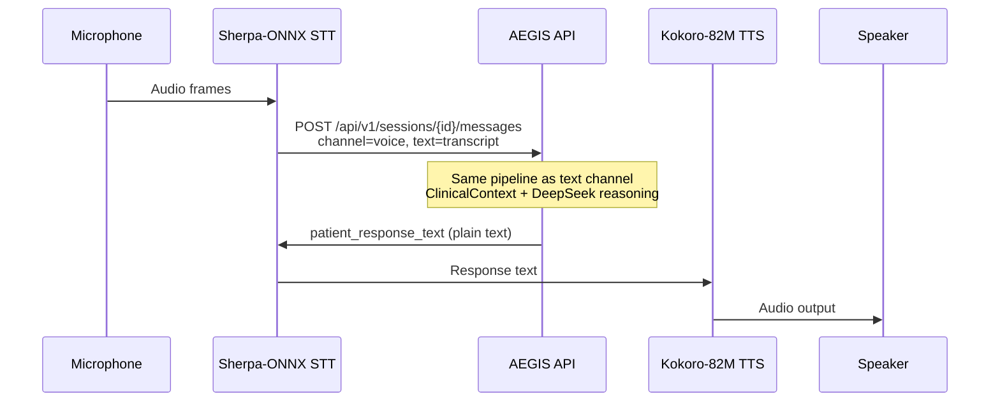
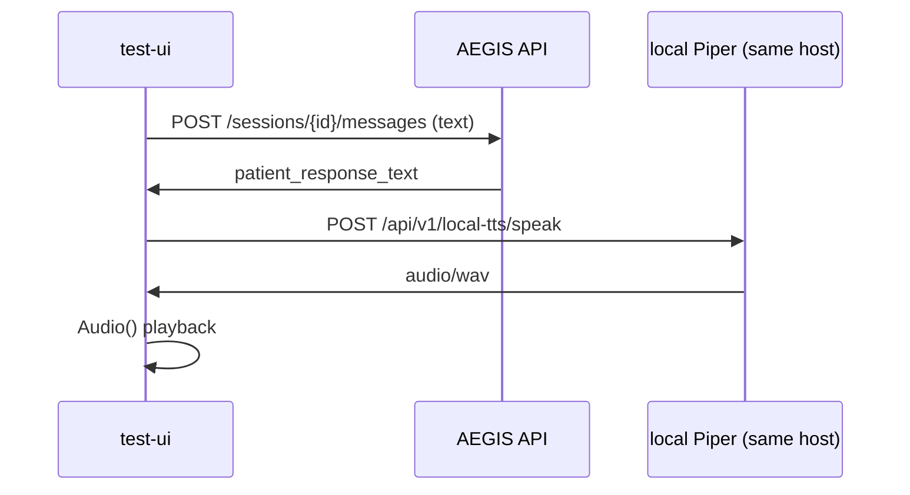

# Voice Pipeline

## Architecture principle

Clinical consultation stays **text-only** on the server. Speech processing for
end users runs on the **client device** (or, for local dev only, on the same
machine via Piper — see below).

The backend receives transcribed text and returns plain-text responses. No audio
bytes are uploaded as part of the AEGIS consultation API.

## Client stack (production)

| Stage | Component | Location |
|-------|-----------|----------|
| Speech-to-text | Sherpa-ONNX | Client device |
| Clinical reasoning | AEGIS REST API | Server |
| Text-to-speech | Kokoro-82M | Client device |

## Local dev / test-ui (Piper)

The temporary **test-ui** at `/test-ui/` can play replies with **local Piper ONNX**
voices when `LOCAL_TTS_ENABLED=true`. Synthesis runs on the same machine as the
FastAPI process (localhost HTTP returning WAV — **not** a remote cloud TTS API).

| Item | Location |
|------|----------|
| Voice models | `voices/piper/*.onnx` (downloaded, gitignored) |
| Catalog | `local_tts/voices.json` |
| Dev routes | `GET/POST /api/v1/local-tts/*` |

Setup: see [local_tts/README.md](../local_tts/README.md).

Production mobile/web clients should **not** depend on these routes; bundle
**Kokoro-82M** on-device instead.

## Sequence (production)



## Sequence (test-ui with local Piper)



## API contract

Create a session with `channel: "voice"` (optional — channel may also be set per message):

```json
POST /api/v1/sessions
{
  "patient_id": "mock-patient-001",
  "channel": "voice"
}
```

Send a voice turn (transcript from Sherpa-ONNX):

```json
POST /api/v1/sessions/{session_id}/messages
{
  "session_id": "{session_id}",
  "user_id": "mock-patient-001",
  "text": "transcribed utterance",
  "channel": "voice"
}
```

Response (identical shape to text channel):

```json
{
  "patient_response_text": "...",
  "ui_hints": {},
  "session_id": "..."
}
```

The production client passes `patient_response_text` to Kokoro-82M for playback.

## Backend behaviour

- `app/agents/voice.py` normalises the channel flag and strips whitespace.
- `SessionMessage.channel` is stored as `"voice"` for analytics.
- Rolling summary, safety layer, and clinician layer processing are unchanged from text.
- `app/api/local_tts_routes.py` serves WAV only when `LOCAL_TTS_ENABLED=true`; it is
  not part of the clinical consultation contract.

## Error handling

Network or API errors on the client should fall back to displaying the error message
or prompting retry. Emergency disclaimers in `patient_response_text` must still be
read aloud when present.

The test-ui falls back to improved browser `speechSynthesis` when local Piper is
unavailable.

## Related documentation

- [local_tts/README.md](../local_tts/README.md) — Piper voices, download, enable flag
- [README](../README.md) — environment and quick start
- [TRAINING_AND_QUALITY.md](./TRAINING_AND_QUALITY.md) — consultation quality model
